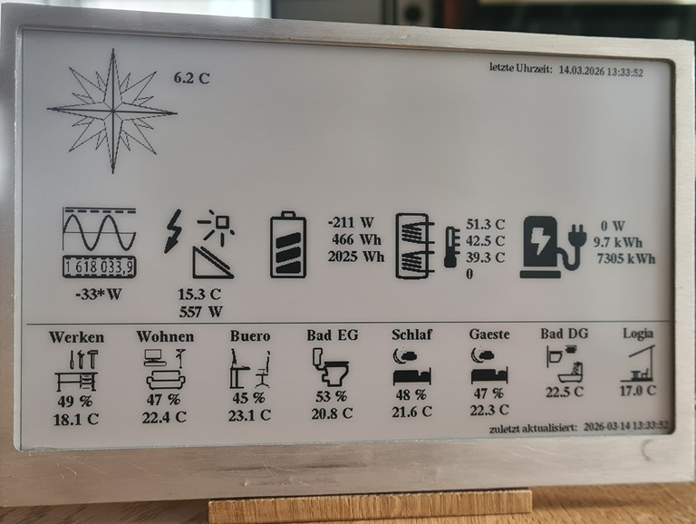
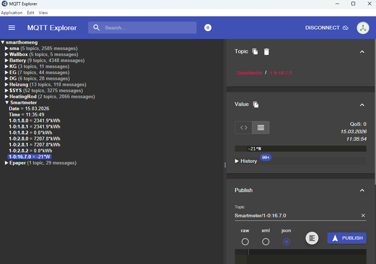

# Epaper_Mqtt

Displaying icons and measured values on an e-paper display:



The Raspberry Pi Pico 2W uses its SPI interface to control a 7.5-inch EPD (Electronic Paper Display) with a resolution of 800 x 480 pixels. I am using a two-colour EPD with black and red.

The icons and data to be displayed can be flexibly configured via the [config.py](https://github.com/heli2src/Epaper_Mqtt/blob/main/config.py) file. 
The Pico receives the measurement values via Wi-Fi from a central MQTT broker.
Upon startup, the dictionary TOPICS = {...} in [config.py](https://github.com/heli2src/Epaper_Mqtt/blob/main/config.py) is evaluated and the corresponding topics are subscribed to at the broker. The received values are formatted and stored as a string in a variable. 

The icons and text to be displayed are defined in the dictionary CONTENT={...}. 

The first three variables in config.py must be set to the Wi-Fi network being used:

  - SERVER = "xxx.xxx.xxx.xxx"    # e.q. "192.168.145.45"
  
  - WlPw = "your wlan password"   
  
  - WlSsid = "name from your wlan"

## Setting up the TOPICS dictionary and subscribing to a topic:

Using the MQTT Explorer (https://mqtt-explorer.com/), you can view all topics and messages from your MQTT broker. 


For example, the reading from the smart meter, which indicates the house’s current power consumption, should be subscribed to from channel 1-0:16-7.0 and stored in the variable `current_power`. Furthermore, the temperature of the heating system’s collector should be stored in the variable `hz_koll`.
```
   TOPICS = {
          "Smartmeter": {
              "1-0:16.7.0": ["current_power"]
              },
        "Heizung": {         
              "Kollektor": {
                  "Temperatur": ["hz_koll", "4.1f", " C"],
                  },              
   }
```
The temperature of the collector is displayed as a floating-point number with one decimal place, with the unit ‘C’ appended at the end. The measured value is then stored as a string in the variable ‘hz_koll’.

## Structure of the CONTENT dictionary for displaying icons and text:
  - "text": {} displays text using the specified font at a specific position (x, y).
  - "tiles": {} displays an icon; text can also be displayed to the right and below the icon.
  - "lines": {} displays lines to separate sections.

For example, the measured values `current_power` and `hz_koll` should be displayed with an icon and their respective values:
   ```
   sxroom = 20
   line2 = 180

   CONTENT = {
      "tiles": {
            "S": {                                           # Solar, if len("E") < 2 than no name will be placed
            "c": ["measure_photovoltaic_inst", tfont21],     # c = content [Name des Icons, Font]
            "p": [sxroom + 115, line2],                      # p = placement (x, y)
            "v": ["hz_koll"]},                               # v = Text vertical placement under the icon, h = horizontal
   ```
The icons must be saved as “Portable Bitmap” files in the “images” directory. To this end, I have written a converter at https://github.com/heli2src/svg2pbm that converts single-colour SVG files into the Portable Bitmap format. Relevant SVG icons can, for example, be obtained from the [smartVISU](https://www.smartvisu.de/) project on [GitHub](https://github.com/Martin-Gleiss/smartvisu/tree/master/icons/sw). Using the converter, they can then be converted into any size.

Due to the large 800 x 480-pixel display, the icons and the various fonts, memory usage is very high, meaning it only runs on a Raspberry Pi Pico 2W with the [RP2350](https://de.wikipedia.org/wiki/RP2350). The [RP2040](https://de.wikipedia.org/wiki/RP2040) has too little internal RAM for this. 

When I was writing the software for the display, MicroPython version 1.25 was the latest available. However, I couldn’t get the power-saving mode `machine.lightsleep(20000)` to work with that version. But as my display is connected directly to the KNX power supply via a voltage converter, I wasn’t too concerned about the average current draw of 25 mA at first.
However, if the e-paper is to be battery-powered, this needs to be improved. 

The Python code is available on my [Github](https://github.com/heli2src/Epaper_Mqtt) page. The project should run once you’ve adjusted the [config.py](https://github.com/heli2src/Epaper_Mqtt/blob/main/config.py). All required libraries are present in the directory; the externally used library versions are from December 2024. The [Peter Hinch Nano-gui](https://github.com/peterhinch/micropython-nano-gui) library is used for the GUI, and the MQTT-Simple version of [miccropython-lib](https://github.com/micropython/micropython-lib/tree/master/micropython/umqtt.simple) is used.

The GitHub section also contains the [CAD files](https://github.com/heli2src/Epaper_Mqtt/tree/main/cad) for the aluminium frame and the electronics box, suitable for milling or 3D printing.